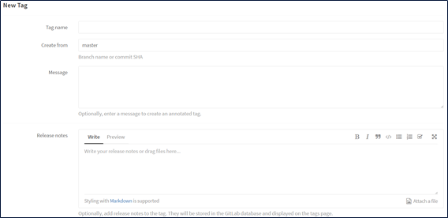
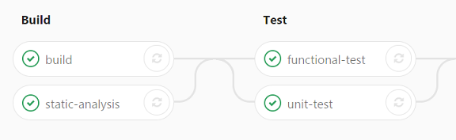

# Inner Source Best Practices

A collection of policies for proprietary ([inner
source](https://en.wikipedia.org/wiki/Inner_source))
Components that follow the open source standards.

## GitLab Workflow

Throughout this document we use
[GitLab](https://gitlab.com). GitLab eases the collaboration
while building a Component. It has much of
[GitHub](https://github.com)'s functionality, but it can be
installed in your own in-house machines for free!

### Working on the Personal Space

Each developer adding new functionality or bug fix for a
Component should follow bellow steps.

 1. __Clone__ the _central remote_ repository of the
    Component to his/her development environment. This
    cloning is commonly called _local repository_ and can be
    done in the command line.
 2. __Fork__ the _central remote_ repository to the personal
    space in GitLab. This is the so-called _personal remote_
    repository and it can be easily done from the GitLab GUI
    by pressing the fork button.
 3. Changes should be __pushed__ from the _local repository_
    to the _personal remote_ repository.

During the above steps, the developer should keep his/her
fork __synchronized__ with the central repository by pulling
its commits.

### Merge Request to the Central Repository

Merge Request is the process of pushing new features or bug
fixes to the _central remote_ repository. Developers or
individual contributors need to trigger the Merge Request,
through GitLab, from the _personal remote_ repository to the
_central remote_.

:warning: The prerequisite to merge the fork to the central
repository is that the code fulfills CI requirements on the
_personal remote_ repository. GitLab can be configured to
forbid merging code when CI fails.

### Reviewing Merge Requests

Every Merge Request to the central repository should be
reviewed by at least one of the Component Development Team
members. Review workflow should follow bellow steps.

 1. All the Component Development Team members receive
    review request notification for every Merge Request
    posted in this central repository. Merge Request
    initiator can mention even more reviewers in the
    description field of the Merge Request in GitLab.
 2. Reviewers receive a notification in their GitLab inbox
    or to their email.
      - In case that no further development or other actions
        are needed for this Merge Request, reviewers should
        write a `Ship it!` comment.
      - In case that further actions should be made, then
        reviewer should point out what adaptations are
        needed for accepting the Merge Request.
 3. Finally, if all reviewers give the green light, the
    Chairperson can accept the Merge Request and the changes
    will be published into the central repository.

:warning: The Chairperson (and their substitute) is the only
ones that are permitted to accept merge requests and push
the commits to the repository. They are granted Master
rights, but this does _not_ mean that they can push their
own commits without review. Even their contributions should
follow the Merge Request road.

## Releases and Versioning

Software versioning is the process of assigning unique
version numbers to unique states of software Component.
Within a given version number category (major, minor, hot
fix), these numbers are assigned in increasing order and
correspond to new developments in the software.

### Versioning and Release Notes

Versioning is implemented with Git Tags in GitLab.

New tags can be created inside the Component's project,
under the tab `Repository` -> `Tags`.

The following information should be filled when creating a
new tag.

  + __Tag name:__ Component's version that need to follow
    either the Internal or External Component versioning
    rules.
  + __Create from:__ Specifies the branch from which the new
    version will be created.
  + __Release note:__ Release notes should be filled for
    every new version/tag.

The latest stable version of a Component can be found in
GitLab.

### Internal Components' Versioning Rules

We use [semantic versioning](http://semver.org/) for all the
Components. Semantic versioning is a widely used versioning
method in the open source community, where each
release/version should contain three numbers separated by
dots. The following figure illustrates the meaning of each
of the three numbers.

Source: Aaron Lott, [What our version numbers
mean](http://digitalcommunications.wp.st-andrews.ac.uk/2017/03/17/what-our-version-numbers-mean)

  + __First digit (major version):__ API change. Not
    compatible with previous major versions.
  + __Second digit (minor version):__ New functionality is
    added with no change in the API. Is always compatible
    with previous minor versions.
  + __Third digit (bug fix version):__ Bug correction. Is
    always compatible with previous minor versions.

### External Components Versioning Rules

In case of an open source Component, which already follows
its own versioning schema in the open source community,
internal release version should be provided by appending the
existing version with an `.innnerX` suffix.

For example, the version `v0.9.6.inner2` denotes that this
is the `2`nd internal version, based on the
version `v0.9.6` which is available in the open source
community.

### Hotfixes

Hotfixes should be applied either to older or to the running
releases, and sometimes merging from one release to another
is required.

> #### A Hotfix Use Case
> 
> Hotfix should be applied to the release tag `v1.0.1`.
> 
>  1. A new hotfix branch should be created from the
>     specific release tag. In this case the `v1.0.1`.
>  2. Push hotfix work-commits to this branch.
>  3. When hotfix is applied and tested, a new __Tag__ and
>     the __Release Notes__ should be created on the latest
>     commit. In this example `v1.0.2`.
>  4. In case that this hotfix should be corrected on the
>     `master` branch (or any other branch), then correction
>     from the hotfix branch should be merged in the
>     `master` branch as well.
>  5. Hotfix branch should be deleted; the tag will remain
>     and branch can be recovered at any time.
> 
> The above use case is presented in the following figure.
> 
> 

## Testing/Verification

Testing is the process of identifying errors that occur
during development cycle. Every Component's Development Team
should ensure high code coverage, at least 95% lines of
code.

### Pipelines and Stages

A pipeline is a group of jobs that get executed in stages.
All the jobs in a stage are executed in parallel (if there
are enough concurrent Runners), and if they all succeed, the
pipeline moves on to the next stage. If one of the jobs
fails, the next stage is not (normally) executed. You can
access the pipelines page in your project's _Pipelines_ tab.
As you can see in the below figure, two stages, `build` and
`test`, have been defined in the `.gitlab-ci.yml` file for
the Component's GitLab project.

However, please note that not all stages are applicable for
all Components. The following table shows mandatory and not
mandatory jobs in the pipeline.

Job             | Description
----------------|-------------
build           | Component should be compiled in GitLab-CI. Build job should include only code build and not any other test or packaging related activities.
static-analysis | This applies to all Components with available source code.
unit-test       | If the Component you are responsible has Unit Tests (UT), then use this job.
functional-test | If the Component you are responsible for has functional tests, use this job.
memory-test     | Tests for memory leaks using e.g. `valgrind`.

Also, please enable the code coverage options on GitLab.

As we already mentioned, GitLab CI uses a YAML file
`.gitlab-ci.yml` for the project configuration. The YAML
file defines a set of jobs with constraints stating when
they should be run.

## Composite Components

_Definition:_ A __composite component__ is a Component which
is created using one or more other Components.

_Example:_ An example of a Composite Component could be
let's say `ldap-redis`, which is based on the
`ldap-dispatcher` and `redis` Components and provides LDAP
user authentication for the Redis database.

### Composite Components and Binaries

A special case of a Composite Component is a Component that
produces a binary package.

_Definition:_ A __binary specification component__ is used
to

 1. fetch the source code from __other__ Component(s)
    repository(ies),
 2. contain the specifications (e.g. RPM SPEC file or
    Dockerfile etc) to build a binary for a specific
    operating system (e.g. Red Hat 7.3),
 3. trigger a GitLab CI job that uses the code in 1. and 2.
    to create a binary file (e.g. RPM or Docker image).

_Example_: We may have a binary specification component
which is named `nss-pam-ldapd-rpm` repository. It contains
the RPM SPEC file and the `.gitlab-ci.yml` file. When the CI
for this Component is triggered,

 1. it fetches the source code from the corresponding
    `nss-pam-ldapd` repository,
 2. it uses the `.spec` file from the `nss-pam-ldapd-rpm`
    repository,
 3. it creates the RPM for Red Hat 7.3.

Multiple Composite Components for other OS targets and
binary formats can be created.

### Exceptions

  + If a third-party Component already contains the binary
    specifications inside the initial source code
    repository, no other (binary specification) repository
    is needed.
      - The packaging CI job is run in the initial
        repository.
  + If the Component Development Team thinks that the *-rpm
    repository is not needed, they may omit creating it.
      - Nevertheless, another team may contribute or take
        care of creating the *-rpm repository if they do
        need it.
